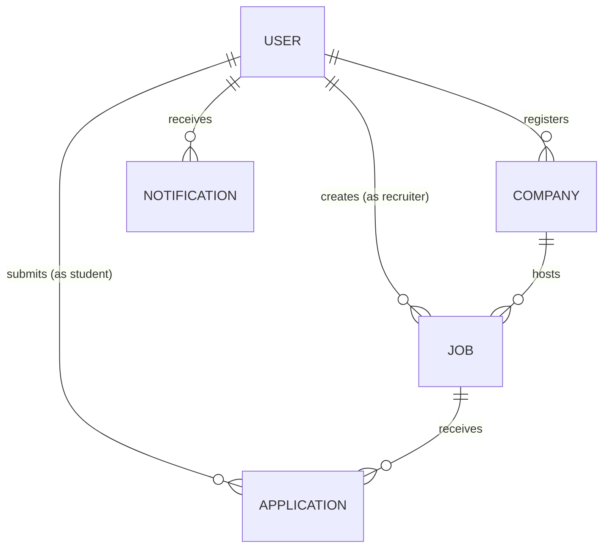
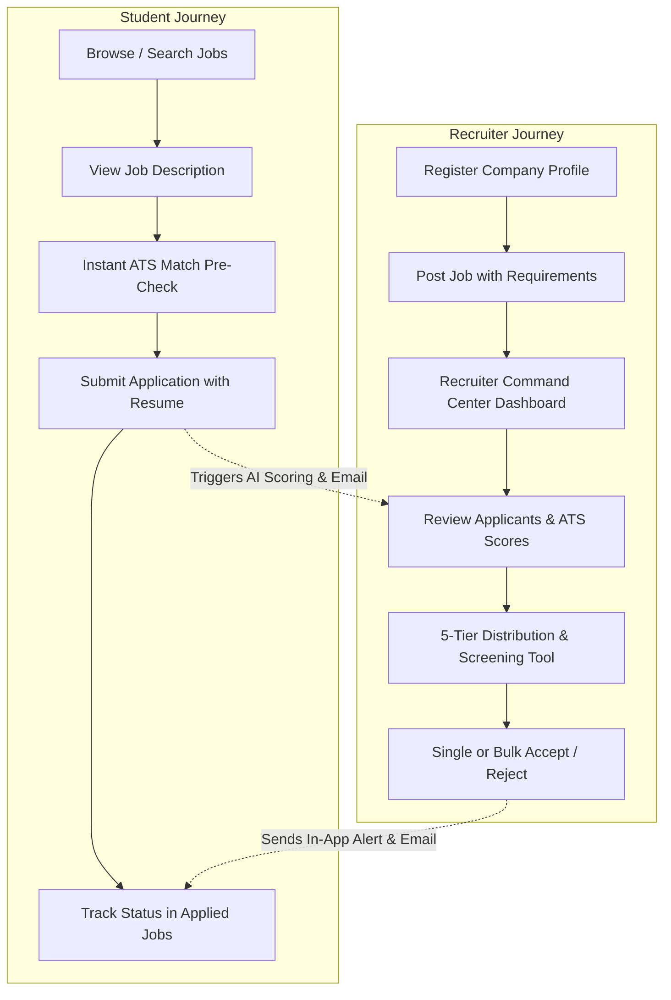

# HireHub — Complete Project Architecture & System Walkthrough

**HireHub** is an enterprise-grade, full-stack **MERN** recruitment and talent acquisition platform. It connects **Job Seekers (Students/Candidates)** and **Recruiters (Hiring Managers)** with an integrated **AI ATS (Applicant Tracking System)** resume evaluation engine, automated candidate screening, real-time in-app notifications, and dual email dispatching.

---

## 1. High-Level Technology Stack

### Frontend Stack
| Technology | Version / Tool | Purpose | Where It Is Used |
| :--- | :--- | :--- | :--- |
| **Framework** | **React 19** + **Vite 6** | Modern reactive UI runtime and fast bundler | Throughout the entire frontend (`frontend/src/`) |
| **Styling** | **Tailwind CSS v4** | Utility-first responsive design, modern gradients, glassmorphism | Configured in `frontend/src/index.css` |
| **State Management** | **Redux Toolkit** + **redux-persist** | Centralized application state persisted in `localStorage` across page reloads | `frontend/src/redux/store.js` |
| **UI Primitives** | **Radix UI** | Accessible modals, dialogs, dropdowns, popovers, select menus | In `frontend/src/components/ui/` (`dialog.jsx`, `popover.jsx`, etc.) |
| **Icons** | **Lucide React** | Consistent, modern iconography | Throughout all components |
| **Toast Alerts** | **Sonner** | Non-blocking floating status notifications | Global toaster mounted in `frontend/src/App.jsx` |
| **Routing** | **React Router DOM v7** | Client-side routing with role-based `ProtectedRoute` | `frontend/src/App.jsx` |
| **Charts & Visuals** | **Recharts** & **Framer Motion** | Dashboard analytics, charts, and smooth animations | `frontend/src/components/admin/Dashboard.jsx` |

---

### Backend Stack
| Technology | Package | Purpose | Where It Is Used |
| :--- | :--- | :--- | :--- |
| **Runtime & Server** | **Node.js** (ES Modules) + **Express 5** | RESTful API server with route modularity | `backhand/index.js` |
| **Database** | **MongoDB** + **Mongoose 8** | NoSQL document storage with relational population | `backhand/utils/db.js` & `backhand/models/` |
| **Authentication** | **JWT** + **bcryptjs** + **cookie-parser** | Stateless HTTP-only cookie authentication & password hashing | `backhand/middleware/isAuthenticate.js` |
| **File Uploads** | **Multer** + **Cloudinary** + **DataURI** | Parsing multi-part form data, uploading resumes & logos to Cloudinary | `backhand/middleware/multer.js`, `backhand/utils/cloudinary.js` |
| **Resume Text Parsing** | **pdf-parse** (v1 & v2 compatible) | Extracts raw text from candidate PDF resumes | `backhand/utils/resumeAnalyzer.js` |
| **Email Delivery** | **Nodemailer** + **Resend** & **Brevo** | SMTP + HTTPS fallback email delivery for application updates | `backhand/utils/emailService.js` |

---

## 2. Database Models & Schema Design (`backhand/models/`)

The platform is powered by five interconnected Mongoose schemas:



1. **`User` (`backhand/models/usermodel.js`)**:
   * `role`: `'student'` or `'recruiter'`.
   * `profile`: Stores `bio`, `skills` (array of strings), Cloudinary `resume` URL, `resumeOriginalName`, `company` reference, `profilePhoto`, and `emailNotifications` preference toggle.
2. **`Company` (`backhand/models/companymodel.js`)**:
   * Holds organization branding: `name`, `description`, `website`, `location`, `logo` URL, and `userId` (owner).
3. **`Job` (`backhand/models/jobmodel.js`)**:
   * Core job details: `title`, `description`, `requirement` (skills list), `salary`, `location`, `jobType`, `experiance`, `position` (openings count), `emailAlerts` (boolean toggle), `company` (ref to Company), `created_by` (ref to User), and `application` (array of refs to Application).
4. **`Application` (`backhand/models/applicationmodel.js`)**:
   * Joins a `job` and an `applicant` (unique compound index prevents duplicate applications).
   * `status`: `'pending'`, `'accepted'`, or `'rejected'`.
   * `aiEvaluation`: Embedded sub-document containing:
     * `score` (0 to 100).
     * `verdict` (*Highly Qualified*, *Qualified*, *Partially Qualified*, *Not Qualified*, *Pending*, *No Resume*).
     * `matchingSkills` & `missingSkills`.
     * `experienceFit`, `strengths`, `concerns`, and executive `summary`.
5. **`Notification` (`backhand/models/notificationmodel.js`)**:
   * In-app real-time notification records linking `recipient`, `type`, `title`, `message`, `isRead`, `relatedJob`, and `relatedApplication`.

---

## 3. Core Engine Deep Dives

### A. The AI ATS Resume Scoring Engine (`backhand/utils/resumeAnalyzer.js`)
Whenever a candidate applies for a job, the platform runs an automated resume evaluation:
1. **Extraction**: `extractTextFromPdf` reads the PDF either locally or downloads it from Cloudinary and extracts raw text using `pdf-parse`.
2. **Skill Normalization & Synonym Matching**:
   * Uses `isSkillMatch` with regex word-boundary anchors (`\b`) and a comprehensive alias dictionary (e.g., `React` matches `react.js`, `reactjs`; `Node` matches `node.js`; `K8s` matches `kubernetes`).
3. **Standardized 100-Point Scoring Rubric**:
   * **70 Points (Skill Match)**: Points are awarded proportionally based on matching requirements ($(\text{matched} / \text{expected}) \times 70$).
   * **30 Points (Practical Evidence)**:
     * **Projects & Portfolio (10 pts)**: Detects evidence of project delivery, GitHub repos, applications built.
     * **Experience & History (10 pts)**: Detects years of experience, internships, or work history.
     * **Education & Certifications (10 pts)**: Detects degrees, certifications, or formal CS coursework.
4. **Verdict Generation**:
   * **80% - 100%**: *Highly Qualified* (Top Match)
   * **60% - 79%**: *Qualified*
   * **40% - 59%**: *Partially Qualified*
   * **< 40%**: *Not Qualified*

---

### B. The 5-Tier ATS Distribution & Bulk Rejection Pipeline (`frontend/src/components/admin/AtsScoreDistribution.jsx`)
On the recruiter's applicant management page:
1. **Score Tiers**: Automatically partitions applicants into 5 non-overlapping tiers:
   * `1 - 20%` (Low Match)
   * `20 - 40%` (Partially Qualified)
   * `40 - 60%` (Moderate Fit)
   * `60 - 80%` (Qualified)
   * `80 - 100%` (Top Match)
2. **Interactive Filtering**: Clicking any tier card filters the data table to inspect candidates in that bracket.
3. **Adjustable Bulk Rejection**:
   * Recruiters adjust a minimum threshold score (slider, numeric input, or quick presets: `<30%`, `<40%`, `<50%`, etc.).
   * A live counter calculates active, non-rejected candidates scoring below the threshold.
   * A safety confirmation dialog displays the affected candidates before calling `POST /api/v1/application/:jobId/bulk-reject` in `backhand/controller/applicationcontroller.js`.
   * The status updates immediately to `rejected`, and automated status notification emails are dispatched.

---

### C. Multi-Channel Notification & Email Engine (`backhand/utils/emailService.js`)
* **Application Received Email**: Sent to the candidate confirming receipt.
* **New Applicant Recruiter Alert**: Sent to the recruiter notifying them of a new submission (respects `emailAlerts` toggle).
* **Status Update Email**: Dispatched when candidate status changes to *Accepted* or *Rejected*.
* **Dual-Delivery Architecture**: Attempts standard SMTP transport, and automatically falls back to HTTPS API delivery (Resend / Brevo) if standard ports are restricted in production hosting (e.g. Render).

---

## 4. Complete Application Flow & Features



### 1. Student / Job Seeker Features
* **`Home.jsx` (`frontend/src/components/Home.jsx`)**:
  * Hero search bar with instant query dispatching to Redux.
  * Category carousel (`Categoery.jsx`).
  * Company logos marquee banner (`CompanyMarquee.jsx`).
  * Latest job cards (`Latestjob.jsx`).
* **`Jobdexcription.jsx` (`frontend/src/components/Jobdexcription.jsx`)**:
  * Detailed job view, salary in LPA, open positions, requirements.
  * **Interactive ATS Pre-Check**: Calculates candidate fit against job requirements *before* applying, showing matching skills and suggestions.
  * 1-Click apply with uploaded resume.
* **`Appliedjob.jsx` (`frontend/src/components/Appliedjob.jsx`)**:
  * Real-time tracker for all submitted applications showing company, role, date, and status badges (*Pending*, *Accepted*, *Rejected*).
* **`Viewprofile.jsx` (`frontend/src/components/Viewprofile.jsx`)**:
  * Candidate portfolio: biography, skill tags, downloadable resume preview, contact info, and profile editor modal.

---

### 2. Recruiter / Admin Features
* **`Dashboard.jsx` (`frontend/src/components/admin/Dashboard.jsx`)**:
  * Visual analytics charts (Applications over time, match score distributions, company activity).
* **`Companies.jsx` & `Companiestable.jsx` (`frontend/src/components/admin/`)**:
  * Enterprise company management.
  * 4 KPI cards (Total Companies, Active Postings, Hiring Activity, Branding Ready).
  * Table View & Card Grid View switcher.
  * Company profile setup, logo upload via Cloudinary, website links, and location tracking.
* **`Adminjobs.jsx` & `AdminjobsTable.jsx` (`frontend/src/components/admin/`)**:
  * Recruiter Command Center for job listings.
  * 4 KPI cards (Total Postings, Candidate Applications, Active Pipelines, Email Alerts).
  * Quick filter tabs (*All Jobs*, *With Applicants*, *Alerts Active*, *Muted*).
  * Direct `👥 X Applicants (Review →)` pill button to jump straight into candidate review.
  * Instant email alert toggle, inline job edit dialog, and deletion confirmation modal.
* **`Applicants.jsx` & `ApplicantsTable.jsx` (`frontend/src/components/admin/`)**:
  * Candidate management for a specific job.
  * `AtsScoreDistribution.jsx` with 5-tier distribution cards, spectrum progress bar, and adjustable bulk-reject screening tool.
  * `AiEvaluationModal.jsx`: Deep-dive modal inspecting matching skills, missing skills, strengths, concerns, and on-demand resume re-analysis.

---

## 5. Directory & File Structure Summary

```
HIRE_HUB-main/
├── backhand/                                 # Express Backend API
│   ├── controller/
│   │   ├── applicationcontroller.js          # Apply, get applicants, bulk-reject, re-analyze
│   │   ├── companycontro.js                  # Register, get, update company profiles
│   │   ├── jobcontroller.js                  # Post, get, update, delete jobs, toggle alerts
│   │   ├── notificationcontroller.js         # In-app notifications
│   │   └── usercontroller.js                 # Register, login, logout, update profile
│   ├── middleware/
│   │   ├── isAuthenticate.js                 # JWT cookie verification middleware
│   │   └── multer.js                         # Memory storage file upload middleware
│   ├── models/
│   │   ├── applicationmodel.js               # Application & aiEvaluation schema
│   │   ├── companymodel.js                   # Company schema
│   │   ├── jobmodel.js                       # Job schema
│   │   ├── notificationmodel.js              # Notification schema
│   │   └── usermodel.js                      # User schema
│   ├── route/                                # Express routers
│   ├── utils/
│   │   ├── cloudinary.js                     # Cloudinary media configuration
│   │   ├── db.js                             # MongoDB connection handler
│   │   ├── emailService.js                   # Nodemailer + HTTPS email transport
│   │   └── resumeAnalyzer.js                 # PDF text extraction & 100-pt ATS evaluator
│   └── index.js                              # Server bootstrap, CORS & cookie parser
│
└── frontend/                                 # Vite + React Frontend
    ├── src/
    │   ├── components/
    │   │   ├── admin/                        # Recruiter views
    │   │   │   ├── Adminjobs.jsx             # Job listings hero & KPI cards
    │   │   │   ├── AdminjobsTable.jsx        # Table / Grid view & job management
    │   │   │   ├── AiEvaluationModal.jsx     # Deep AI score breakdown modal
    │   │   │   ├── Applicants.jsx            # Applicants page container
    │   │   │   ├── ApplicantsTable.jsx       # Applicants table & actions
    │   │   │   ├── AtsScoreDistribution.jsx  # 5-tier breakdown & bulk-reject tool
    │   │   │   ├── Companies.jsx             # Company directory hero & KPI cards
    │   │   │   └── Companiestable.jsx        # Company table & grid view
    │   │   ├── auth/                         # Login & Registration
    │   │   ├── shared/                       # Navbar & Footer
    │   │   ├── ui/                           # Radix UI primitives & styled components
    │   │   ├── Appliedjob.jsx                # Candidate application status tracker
    │   │   ├── Jobdexcription.jsx            # Job details & ATS pre-check
    │   │   └── Viewprofile.jsx               # Candidate profile & resume preview
    │   ├── redux/                            # Redux Toolkit slices (auth, job, company, etc.)
    │   ├── hooks/                            # Custom data fetching hooks
    │   └── util/const.js                     # API endpoints & formatSalary helper
    └── package.json
```

---

## 6. How to Run Locally

1. **Backend Server**:
   ```bash
   cd backhand
   npm install
   npm run dev
   # Runs on http://localhost:8000
   ```
2. **Frontend Client**:
   ```bash
   npm install
   npm run dev
   # Runs on http://localhost:5173
   ```
